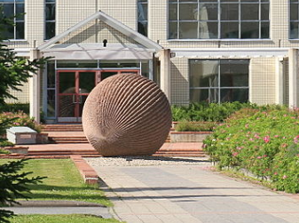
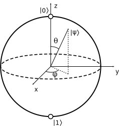

# how_to_understand_quantum_mechanics

"No one understands quantum mechanics"
 - Richard Feynman

"Shut up and calculate"
 - David Mermin

"... do the other things, not because they are easy, but because they are hard"
 -  John F. Kennedy

## Introduction videos and courses

* https://www.microsoft.com/en-us/research/video/quantum-computing-computer-scientists/#!related_info
 - Andrew Helwer: "All except math is basically just a lie"

* https://www.coursera.org/learn/quantum-computing-algorithms
 - Sysojev Sergei Sergeevitš: "Multiple worlds"

* Also read the Wikipedia

## Joke about math

- How one could describe dry math jokes?
- How?
- They are dry.

(Straight from the definition)

## Finnish joke about the science

This statue at the Yard of the University of Oulu describes science:

- "Ympäripyöreää ja urautunutta!"
- "Ambiguous and over professional"

## Quantum mechanics is like a long and dry math joke

When people speak about understating, they usually refer to the feeling. 
I try to trigger that feeling by trying to formalize quantum mechanics in
to a form of a long and dry math joke.

## More than a bit

Traditional bit (B) can have values 1 and 0. 

How could one quantum bit (Q), which is still a bit, but something more also at the same time?

Lets try a trick: define the quantum bit so that the extra bit in the bit can not be measured, so
maybe we never have to define it really.

Measurement is a term used with probabilities.

Lets try to define the measurement `M` of the quantum quantum bit `Q` probabilities somehow:

`P(M(Q) = 0) = ?`

`P(M(Q) = 1) = ?`

If the probability `P(M(Q) = 0)` is the whole information content of the qubit, then it could be measured by repetitive measurements
and thus described as bits. It has to be something more.

## The usual mathematical mysteries

* If `x^2 = 1` is `x = +1` or `x = -1`?

This leaves only one bit as a hidden variable. We can do better, by adding one dimension more!

* If `x^2 + y^2 = 1` now what are `x` and `y`?

How that is connected to the measurement `M`?

The basic measurement of all is the measurement of the length:

`|a| = sqrt( x_a^2 + y_a^2 )`

So lets define:

`P(M(Q) = 0) = |a|^2`

`P(M(Q) = 1) = |b|^2`

where the `a` and `b` are complex numbers `a = x_a + y_a*i` and `b = x_b + y_b*i`

## The Bloch sphere

Because the bit is either 0 or 1 `|a|^2 + |b|^2 = 1` can the qubit `Q` be formed:

`Q = alpha * |0> + beta * |1>`

or:

where

## The joke?

In a way science is the universe trying to understand itself. Scientists are quantum mechanical beings, so it
should not be a surprise that the quantum bit is a bit like science:

Ambiguous like a sphere and can unfortunately be done only by professionals.

Kubitti on ympäripyöreä ja hieman urautunut.

